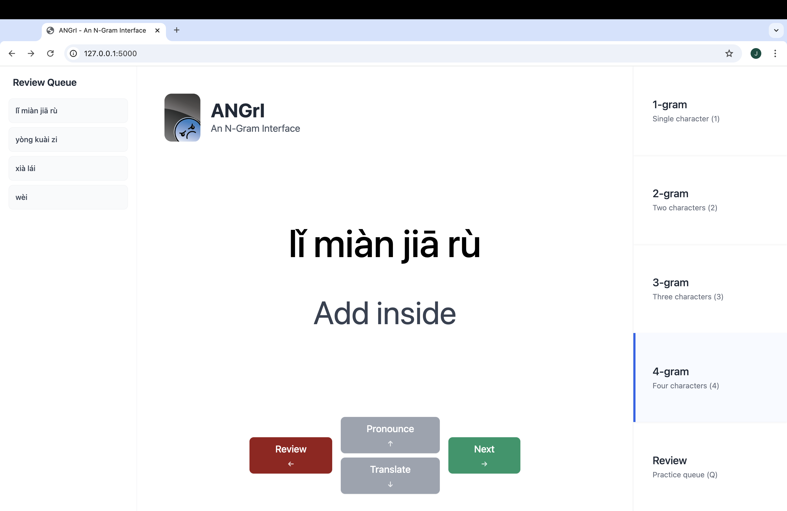

# 😠 ANGrI - An N-Gram Interface

> A better way to practice Chinese vocabulary using n-grams! 🎉

## Credits

N-gram models were trained using transcripts from the wonderful Chinese cooking YouTube channel [一画美食 One Foodie](https://www.youtube.com/@onefoodie) 🧑‍🍳

## How to Use

1. **Choose Your N-gram Model**
   - Pick from 1-gram to 4-gram models (use keys 1-4)

2. **Practice Controls**
   - ➡️ (Right Arrow) - Generate new characters
   - ⬆️ (Up Arrow) - Hear pronunciation
   - ⬇️ (Down Arrow) - Show/hide translation
   - ⬅️ (Left Arrow) - Add to review queue
   - Q - Switch to review mode

## Getting Started

1. Install dependencies:

```bash
pip install flask pypinyin
```

2. Run the Flask server:

```bash
python main.py
```

3. Visit `http://127.0.0.1:5000/` and start learning! 🎓

## Screenshot


